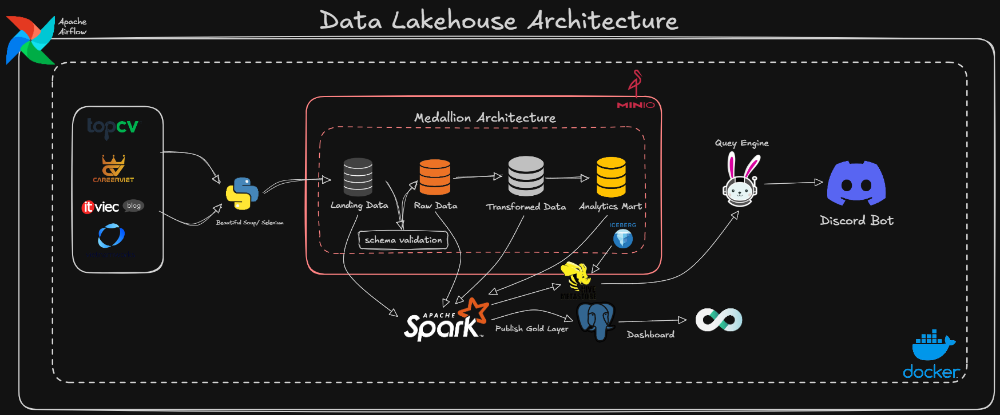
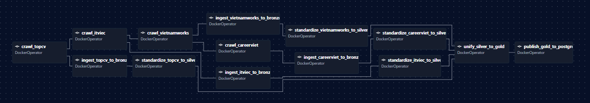
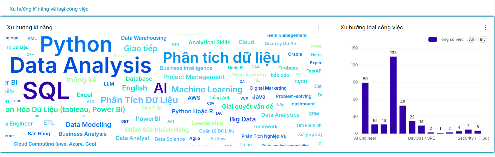

# 🏢 IT Job Analytics Data Lakehouse


Dự án Xây dựng Hệ thống **Data Lakehouse** phân tán, phục vụ việc tự động thu thập, xử lý, lưu trữ và trực quan hóa dữ liệu thị trường việc làm IT tại Việt Nam.

Dự án áp dụng chặt chẽ kiến trúc **Medallion (Bronze, Silver, Gold)**, tích hợp **Apache Iceberg** trên nền tảng Object Storage **MinIO**, và được điều phối hoàn toàn bằng **Apache Airflow**.

---

## 🛠️ 1. Công nghệ sử dụng (Tech Stack)

| Lớp (Layer) / Vai trò | Công nghệ & Công cụ (Tech & Tools) |
| --- | --- |
| **Ngôn ngữ lập trình** | Python 3 |
| **Thu thập dữ liệu (Extract)** | BeautifulSoup, Requests, Selenium |
| **Lưu trữ (Object Storage)**| MinIO (S3-compatible) |
| **Định dạng bảng (Table Format)**| Apache Iceberg |
| **Catalog**| Hive Metastore |
| **Xử lý dữ liệu (Processing)** | Apache Spark (PySpark) |
| **Điều phối luồng (Orchestration)**| Apache Airflow |
| **Truy vấn phân tán (Query Engine)**| Trino |
| **Cơ sở dữ liệu phục vụ (Serving)**| PostgreSQL |
| **Phân tích & Trực quan (BI)** | Apache Superset |
| **Giao diện & Tương tác (App)** | Discord Bot (`discord.py`) |
| **Hạ tầng triển khai (Infra)** | Docker, Docker Compose |

---

## 🏗️ 2. Kiến trúc Hệ thống (Architecture Flow)

Toàn bộ luồng đi của dữ liệu từ khi nằm trên các trang tuyển dụng cho đến khi được phục vụ cho người dùng cuối qua Dashboard và Discord Bot:





---

## 🧩 3. Cấu trúc Luồng dữ liệu (Data Pipeline)

### 📥 Data Crawling & Landing
- Thu thập dữ liệu hàng ngày bằng Python từ 4 nguồn: **TopCV, ITViec, VietnamWorks, CareerViet**.
- Dữ liệu thô (Raw JSON/CSV) được đẩy thẳng vào `Landing Zone` trên MinIO.

### 🥉 Lớp Bronze (Raw Data)
- **Công nghệ**: PySpark & Apache Iceberg.
- **Xử lý**: Đưa dữ liệu thô từ Landing vào các bảng Iceberg. Áp dụng **Hidden Partitioning** theo ngày nạp (`ingest_date`) để tối ưu hiệu suất truy vấn. Dữ liệu được `APPEND` liên tục mà không thay đổi cấu trúc gốc.

### 🥈 Lớp Silver (Cleansed & Conformed Data)
- **Công nghệ**: PySpark & Apache Iceberg.
- **Xử lý**: 
  - Gộp (UNION) các bảng riêng lẻ từ các nguồn khác nhau thành cấu trúc thực thể chuẩn.
  - Làm sạch (Data Cleansing), chuẩn hóa kiểu dữ liệu (Casting).

### 🥇 Lớp Gold (Aggregated & Business Data)
- **Công nghệ**: PySpark & Apache Iceberg.
- **Xử lý**:
  - Nhào nặn dữ liệu theo chuẩn **Kimball (Star Schema)** gồm các bảng Fact (Sự kiện) và Dimension (Danh mục).
  - Tối ưu hóa dữ liệu để sẵn sàng cho nghiệp vụ phân tích BI.

---

## 🚀 4. Tính năng Nổi bật (Key Features)

- **100% Dockerized**: Toàn bộ các service (Airflow, Spark, Trino, MinIO, Superset, Bot) đều được đóng gói và chạy cô lập trong Docker Container.
- **Tự động hóa hoàn toàn**: Airflow DAG `daily_job_pipeline` tự động kích hoạt tiến trình Crawl -> Ingest -> Transform -> Load.
- **Zero-Downtime Serving (Blue/Green Deployment)**: Khi đồng bộ dữ liệu từ lớp Gold sang PostgreSQL, dự án sử dụng chiến lược Blue/Green Deployment (ghi vào bảng tạm và dùng kỹ thuật Atomic RENAME). Điều này đảm bảo hệ thống Dashboard và Bot không bao giờ bị gián đoạn (downtime) trong quá trình cập nhật dữ liệu hàng ngày.
- **Kiểm soát Chất lượng & Cách ly Dữ liệu lỗi (Schema Validation & Quarantine)**: Dữ liệu thô từ Crawler được xác thực chặt chẽ bằng JSON Schema trước khi đưa vào Data Lake. Mọi dòng dữ liệu sai định dạng (Corrupt Records) sẽ tự động bị tách khỏi luồng chính và đẩy vào khu vực cách ly (Dead Letter Queue/Quarantine trên S3) để phân tích sau, bảo vệ tuyệt đối tính toàn vẹn cho lớp Bronze.
- **Quản lý Vòng đời Dữ liệu (Lifecycle)**: Tự động xóa rác ở vùng Sandbox và đưa dữ liệu thô cũ sang Cold Storage trên MinIO để tiết kiệm dung lượng.
- **Trực quan hóa đa dạng**: Hỗ trợ Dashboard phân tích chuyên sâu qua Superset và truy vấn nhanh gọn qua trợ lý ảo Discord Bot (tích hợp SQL Engine Trino).

---

## 🖼️ 5. Giao diện & Kết quả Thực tế (Screenshots)

Dưới đây là một số hình ảnh thực tế từ các công cụ trong hệ thống (Superset, Airflow, Trino, MinIO, Discord Bot...):

<div align="center">
  
  <br/><br/>
  
  <br/><br/>
  
  <br/><br/>
  
  <br/><br/>
  
  <br/><br/>
  
  <br/><br/>
  
</div>

---

## 🛠️ 6. Hướng dẫn Cài đặt & Triển khai (Setup Guide)

**Yêu cầu hệ thống:** Máy tính đã cài đặt **Docker** và **Docker Compose**.

### Bước 1: Cấu hình Môi trường
Mở file `bot/.env` và thiết lập Token kết nối Discord Bot:
```env
DISCORD_BOT_TOKEN=your_bot_token_here
```

### Bước 2: Build các Docker Images
Chạy script để đóng gói mã nguồn của Crawler, Spark, và Bot thành Docker Image:
```bash
chmod +x config/dockerfile/build_images.sh
./config/dockerfile/build_images.sh
```

### Bước 3: Khởi động Hệ thống
Dựng toàn bộ kiến trúc Data Lakehouse (Postgres, MinIO, Hive Metastore, Trino, Airflow, Superset, Discord Bot):
```bash
docker-compose up -d
```

### Bước 4: Khởi tạo Storage & Namespace
Chạy kịch bản khởi tạo Buckets trên MinIO và các Namespace (Bronze, Silver, Gold) cho Iceberg:
```bash
bash minIO/scripts/full_deploy.sh
```

### Bước 5: Truy cập các Dịch vụ
Sau khi hệ thống đã up thành công, bạn có thể truy cập qua các địa chỉ sau:
- **Apache Airflow:** `http://localhost:8080` *(Bật DAG `daily_job_pipeline` để chạy hệ thống)*
- **MinIO Console:** `http://localhost:9001` *(Tài khoản: minioadmin / minioadmin)*
- **Apache Superset:** `http://localhost:8088` *(Tài khoản: admin / admin)*
- **Trino UI:** `http://localhost:8089`
- **Discord Bot:** Gõ lệnh `!job search <từ_khóa>` trực tiếp trên server Discord của bạn.

